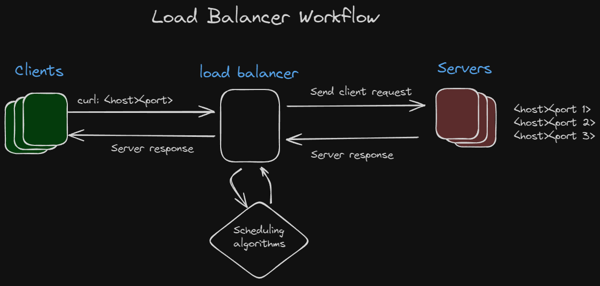

# load-balancer
Writing my own load balancer in Go

Coding Challenges - Write Your Own Load Balancer

[Reference](https://codingchallenges.fyi/challenges/challenge-load-balancer/)

## Step 1: 
Create a server that listens for a connection on a port.

The load balancer will act as a proxy between client and backend server

The load balancer should forward a request to the backend server and send the response back to client

Tasks:
- Implement websocket for client and server to allow for HTTP requests
- Add concurrency to allow for multiple connections from multiple clients
- Add the load balancer, it talks to the clients as a server but talks to the backend servers as a client
- Implement multiple backend servers that connect to open ports randomly, when a backend server is connected, the load balancer should know it's host and port

## Step 2:
This step involves implementing a scheduling algorithm like round-robin.

The goal is to distribute incoming client requests among 2 servers

Tasks:
- Extend load balancer to allow for multiple backend server connections
- Implement the scheduling algorithm and distribute the messages to the different servers

## Step 3:
This step is to for failure detection among the servers

Periodically conduct health checks on the servers by pinging them with HTTP request

Tasks:
- Create a list of healthy servers that the load balancer will send requests to
- Allow user to set health check period via CLI
- If server fails health check, remove it from healthy list. Add it back once it's online again

## Further Enhancements
- Automated testing to stand up servers, clients, load balancer, sending HTTP requests. Check the load balancer can handle multiple clients at same time
- Add logging - think about what information would be helpful to know
- Implement other scheduling algorithms and allow user to set which one they prefer via CLI. Could graph effectiveness to determine best algorithm 
